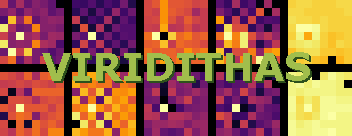

# Viridithas, a UCI chess engine written in Rust

<div align="center">

  
  
  [![Build][build-badge]][build-link]
  [![License][license-badge]][license-link]
  [![Release][release-badge]][release-link]
  [![Commits][commits-badge]][commits-link]
  
</div>

Viridithas is a free and open source chess engine, that as of 2024-08-22 is the strongest chess program written in Rust, and the strongest chess program by a UK author.
These claims are based on my own personal tests and aggregate results from multiple public rating lists. If these claims are no longer true, it's likely due to the hard work of some of my friends in the chess-programming community, most likely the authors of [Stormphrax](https://github.com/Ciekce/Stormphrax) & [Black Marlin](https://github.com/jnlt3/blackmarlin). The Viridithas project prides itself on using original training data for its neural networks.

Viridithas is a command-line program that can be used from the terminal or can communicate with a graphical user interface over the UCI protocol.

For an overview of the features of Viridithas, see the [viri-wiki](https://cosmo.tardis.ac/files/2023-02-20-viri-wiki.html).

## Building Viridithas

If you just want one of the official releases of Viridithas, check out the **Releases** tab on the right. If you want to build a specific version of Viridithas from source (say, the latest and greatest master commit) then follow these instructions:

0. Before following any of these instructions, make sure you have [Rust](https://www.rust-lang.org/tools/install) installed. You may also need to install the `clang` C compiler for tablebase probing support.
1. Clone this repository to your machine via `git clone https://github.com/cosmobobak/viridithas`.
2. Enter the source directory via `cd viridithas`.
3. (optional, likely unnecessary) select the branch you'd like to compile via `git checkout <BRANCH_NAME>`.
4. Download the corresponding neural network for the version of Viridithas that you are compiling and save it in the source root as `viridithas.nnue`. All of Viridithas's neural networks can be found in the releases of the [viridithas-networks](https://github.com/cosmobobak/viridithas-networks) repo. Networks are stored seperately from this repo due to file-size considerations.

    **If you just want the latest neural net**, you can download it with the command `curl -s "https://api.github.com/repos/cosmobobak/viridithas-networks/releases/latest" | grep -o '"browser_download_url": "[^"]*' | awk -F'"' '{print $4}' | xargs -L 1 wget -O viridithas.nnue.zst`.

5. Build Viridithas.
   
   **On Windows**, run 
   ```
   > $env:RUSTFLAGS="-C target-cpu=native"
   > cargo b -r --features syzygy,bindgen
   ``` 
   **On Linux**, run
   ```
   > RUSTFLAGS="-C target-cpu=native" cargo b -r --features syzygy,bindgen
   ```
   You now have a fully-functional version of Viridithas at the path `target/release/viridithas`.

## Evaluation Development History/Originality (HCE/NNUE)

- First evaluation was a simple piece value / psqt table approach, using values from PeSTO. (as far as I remember)
- Early in development, a local-search texel tuning module was developed, and trained on the Lichess Elite dataset, removing the PeSTO values with increased strength.
- Many new evaluation terms were added during development, and were continually re-tuned on Viridithas's self-play games.
- The first NNUE was trained on a dataset of games played by Viridithas 2.7.0, 2.6.0, and 2.5.0, all rescored with a development version of Viridithas 2.7.0 at low depth.
- Subsequent networks were trained on additional self-play games by subsequent versions of Viridithas. The 13th-generation network, and many since, include positions from the Lichess Elite dataset rescored by Viridithas.
- Between versions 7.0.0 and 8.0.0, original datagen code was written that allows Viridithas to generate data without need for an opening book to ensure game variety, resulting in even greater strength of play.

All neural networks currently used in the development of Viridithas are trained exclusively on its own self-play games, and no network has ever been trained on the output of an engine other than Viridithas.

## Thanks and Acknowledgements

[python-chess](https://github.com/niklasf/python-chess), without which I would never have been able to gain a love for chess programming.

The [VICE](https://www.youtube.com/playlist?list=PLZ1QII7yudbc-Ky058TEaOstZHVbT-2hg) video series, which was invaluable for explaining how various chess engine concepts can be implemented.

Andrew Grant's [Ethereal](https://github.com/AndyGrant/Ethereal), the exceedingly clear code of which helped me realise several horrible flaws in Viridithas.

[weather-factory](https://github.com/dsekercioglu/weather-factory), which I used only minimally, but which is still responsible for about ~10 elo in Viridithas.

[marlinflow](https://github.com/dsekercioglu/marlinflow), was responsible for neural network training for Viridithas up until version 11.0.0.

[bullet](https://github.com/jw1912/bullet), which I have used for neural network training in the development of Viridithas since version 11.0.0.

[The SweHosting OpenBench Instance](https://chess.swehosting.se/), which is invaluable in testing new patches and features.

[build-badge]:https://img.shields.io/github/actions/workflow/status/cosmobobak/virtue/rust.yml?branch=master&logo=github&style=for-the-badge
[build-link]:https://github.com/cosmobobak/virtue/actions/workflows/rust.yml
[commits-badge]:https://img.shields.io/github/commits-since/cosmobobak/virtue/latest?style=for-the-badge
[commits-link]:https://github.com/cosmobobak/virtue/commits/master
[release-badge]:https://img.shields.io/github/v/release/cosmobobak/virtue?style=for-the-badge&label=official%20release
[release-link]:https://github.com/cosmobobak/virtue/releases/latest
[license-badge]:https://img.shields.io/github/license/cosmobobak/virtue?style=for-the-badge&label=license&color=success
[license-link]:https://github.com/cosmobobak/virtue/blob/master/LICENSE
